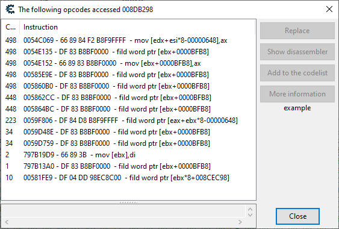

An aimbot is a tool that automatically aim in shooter game. As a fun small little RE project, I wanted to try to create one for an old 2d shooter game called Soldat.
I mostly used Cheat Engine for the debugging and DLL injection.

So, to aim at a character, we first need his position.
by continuously scanning the memory with cheat engine, the memory space that contains the global coordinates of the npc is found relatively quickly:
```
x: (2 byte, signed short) 0x0076AC08
y: (2 byte, signed short) 0x0076AC0C
```

As the shooting angle is determined by the mouse cursor, the second step is to find the coordinates of the pointer. This step is also relatively easy by watching which memory location is modified after moving the mouse:
```
x: (4 bytes, float) 0x008DB298
y: (4 bytes, float) 0x008DB29A
```

by looking at which operators access these values, we can deduce which part of the code is executed when we fire with our character. This show us the function called when firing:



```nasm
; (...)
; Pointer X:
fild word ptr [ebx+0000BFB8] ; convert signed int to float and push onto FPU
fstp dword ptr [esp] ; push float on the stack. ptr on ESP
wait 
; Pointer Y:
fild word ptr [ebx+0000BFBA]
fstp dword ptr [esp+04]
wait 
; (...)
call soldat.exe+82918 ; func to calculate the angle to the target
; (...)
call soldat.exe+82974 ; actual fire function
```

After debugging for a while, I decided to simply keep the same logic but change the values of the pointer right before `fild` is called. 
Both pointer position and npc position were using global (world) coordinate so the only modification I had to make to the npc position was to cast it from `float` to `short`.  To do that I used dll injection & hook function.

## DLL injection & Hook function
The objective here is to overwrite the values of the pointer by the values of the NPC before executing the rest of the function that takes care of the shooting. As the memory space in the function is limited, the most flexible way to achieve this is to create our own function that will be executed right before. This can easily be done by creating a x86 dll and injecting it with cheat engine, procexp or manually.

```
  +------------------+   +---------+
->| Read pointer pos |-->|  Shoot  |
  +------------------+   +---------+
```

```
                                 +------------------+   +---------+
-->+ (jmp)                       | Read pointer pos |-->|  Shoot  |
   |                             +------------------+   +---------+
   |   +----------------------+    |
   +-->| Read npc pos & write |>---+
       | to pointer pos       |
       +----------------------+
```

In this case, we will replace the first `fild`  instruction by a jmp to our hook function as we don't want to overwrite the next instructions. `fild word ptr [ebx+0000BFB8]` is `DF 83 B8BF0000` so we need a jmp with the exact same number of bytes (6). 
```
<jmp><hook addr><nop offset> => 1 + 4 + 1 = 6 bytes
=> 0xe9 <???> 0x90
```

To get the `Hook` function address, we can simply use the `GetProcAddress` windows function. One thing to notice is that `jmp` is always relative which mean we have to calculate the relative distance to the destination. 
```cpp
DWORD hookAddr = (DWORD)GetProcAddress(dllHandle, "Hook");
DWORD dstAddr = 0x0059008D; // fild address
DWORD offset = hookAddr - dstAddr - 5; // relative distance, 5 is the number of bytes used by jmp(1) + addr(4)
```

I created a simple struct to store patch and original code:
```cpp
struct Patch {
    vector<BYTE> originalPatch;
    vector<BYTE> newPatch;
};
```

## Patching & Unpatching
If we want to directly write to memory, we first need to allow `read write` permission by using `VirtualProtect`. I created a custom function for that:
```cpp
template<typename T>
void Write(DWORD addr, T value)
{
    DWORD oldprotect;
    VirtualProtect((void*)addr, sizeof(T), PAGE_EXECUTE_READWRITE, &oldprotect);
    *((T*)addr) = value;
    VirtualProtect((void*)addr, sizeof(T), oldprotect, &oldprotect);
}
```

I also created two functions to handle patching/unpatching if we simply want to apply or remove the change we did:
```cpp
void HandlePatching(int addr, Patch& patch)
{
    if (patch.originalPatch.empty()) {
        BYTE bytes[64]; // max patch size

        ReadProcessMemory(gameHandle, (void*)addr, &bytes, patch.newPatch.size(), 0);
        patch.originalPatch = std::vector<BYTE>(std::begin(bytes), std::end(bytes));
        patch.originalPatch.resize(patch.newPatch.size());
    }

	// write byte by byte
    for (unsigned int i = 0; i < patch.newPatch.size(); i++) {
        Write<BYTE>((int)(addr + i), patch.newPatch[i]);
    }
}

void HandleUnpatching(int addr, Patch& patch)
{
    for (unsigned int i = 0; i < patch.originalPatch.size(); i++) {
        Write<BYTE>((int)(addr + i), patch.originalPatch[i]);
    }
}
```

I then converted the instructions to my custom `Patch` struct. I also created a loop which allow us to activate/desactivate the patch by pressing `F4`:
```cpp
// Main thread

BYTE byteArray[sizeof(DWORD)];
memcpy(byteArray, &offset, sizeof(DWORD)); // convert the offset to an array of BYTE
Patch aimBot = Patch {
	vector<BYTE> {},
	vector<BYTE> {
		0xe9, byteArray[0], byteArray[1], byteArray[2], byteArray[3], 0x90 // jmp <offset> nop
	},
};

bool running = false;
while (true) {
	if (GetAsyncKeyState(VK_F4) & 0x80000) {
		running = !running;
		if (running) {
			HandlePatching(dstAddr, aimBot);
			cout << "Hack activated" << endl;
		} else {
			HandleUnpatching(dstAddr, aimBot);
			cout << "Hack desactived" << endl;

		}
		Sleep(200);
	}
}

```

Pressing `F4` should change:
```
DF 83 B8BF0000        - fild word ptr [ebx+0000BFB8]
```
to
```
E9 DE126078           - jmp SoldatDLL.Hook
90                    - nop
```

## Hook function
First we need struct to store the npc and pointer position addresses we found earlier:
```cpp
struct AddrPosition {
    DWORD x;
    DWORD y;
};

AddrPosition npc1Position = {
    0x0076AC08,
    0x0076AC0C
};

AddrPosition pointerPosition = {
    0x008DB298,
    0x008DB29A,
};

extern "C" DWORD retAddr;
```

One thing to notice is to avoid an infinite loop, we need to tell where to continue after our hook function is finished. To do that, we just add our patch offset size to the original target address.
```cpp
retAddr = dstAddr + aimBot.newPatch.size(); // 0x0059008D + 5 = 0x00590092
```

For the actual hook function, two attributes are needed:
 - `naked` allow us to skip the stack frame creation and change return address
 - `dllexport` make it visible for the main process

```cpp
extern "C" _declspec(naked, dllexport)
void Hook() noexcept
{
    __asm
    {
        pushad // save all general registers
    }

	// cast npc position (float) to short int and
	// write the result in 0x008DB298 & 0x008DB29A
    Write<short>(pointerPosition.x, (short) *(float*)npc1Position.x);
    Write<short>(pointerPosition.y, (short) *(float*)npc1Position.y - 10);

    __asm
    {
        popad // restore registers
        fild word ptr[ebx + 0x0000BFB8] // restore the instruction we overwrote with our JMP
        push retAddr // push the new ret address
        ret // => fstp dword ptr [esp]
    }
}
```

As the origin is at the bottom of its hitbox, we need to add a small offset to center the shots. Our pointer position is now quickly moved to the center of the npc position each time we shoot:


The aimbot is extremely simple and does not take into account bullet drop or even multiple npc. Perhaps I'll do a second chapter once.

*PS: This little exercise is for educational purposes only and will not work online anyway as the DLL injection is detected by the anti cheat system so no need to try. :>*
